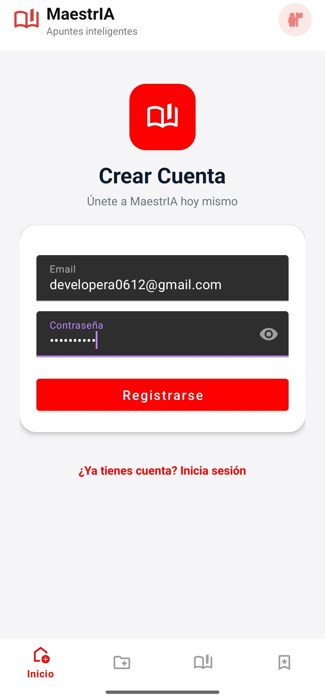
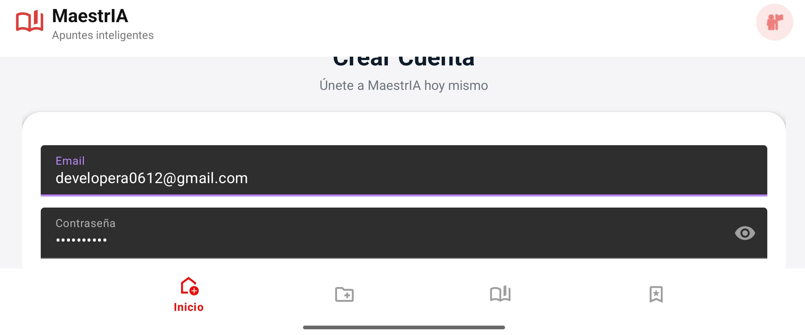
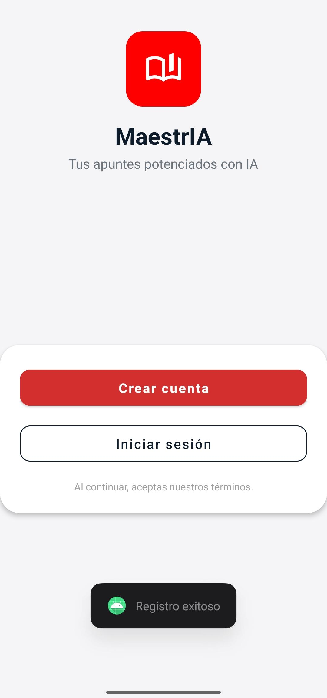
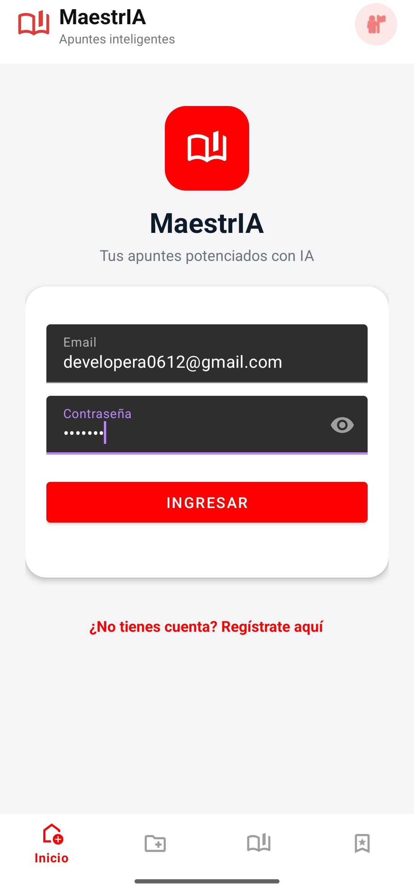
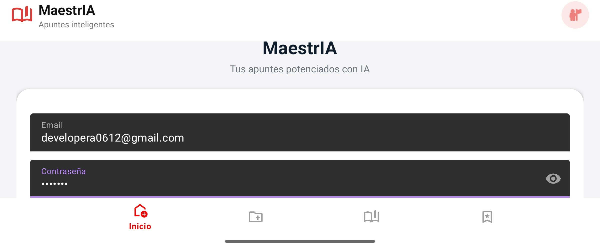
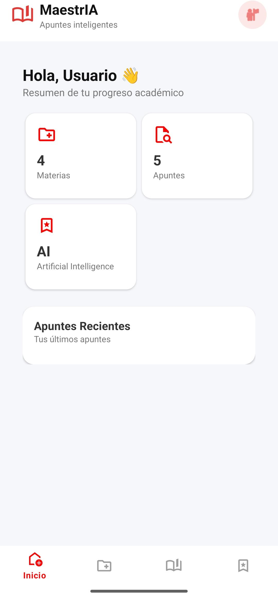

## Semana 6 — Eventos y estados
Durante la ejecución del prompt que redactamos en el archivo `PROMPT.md` en este mismo directorio, la IA propuso varios cambios en la estructura de la aplicación, tanto a nivel visual como en la lógica de negocio o el core de nuestra aplicación (maestrIA).

### Archivos Modificados:
- `LoginViewModel.kt`: Implementación de lógica de login y estado de UI.
- `LoginFragment.kt`: Observación de estado y vinculación con la vista.
- `SignUpViewModel.kt`: Implementación de lógica de registro y estado de UI.
- `SignUpFragment.kt`: Observación de estado y vinculación con la vista.

## 1. Desición #1: Arquitectura MVVM con StateFlow

**PROPUESTA DE LA IA:** migrar de `LiveData` a `StateFlow` para el manejo de estados reactivos.

**DESICIÓN TOMADA:** La decisión de utilizar `StateFlow` en lugar de `LiveData` fue tomada y adaptada a las necesidades del proyecto.

**RAZÓN:** El uso de `StateFlow` asegura que siempre haya un estado disponible para la vista, incluso tras una rotación de pantalla.

## 2. Desición #2: Manejo de Estado con UiState

**PROPUESTA DE LA IA:** Definir data classes específicas para el estado de cada pantalla (`LoginUiState` y `SignUpUiState`) para centralizar el flujo de datos.

**DESICIÓN TOMADA:** Se implementaron clases de estado centralizadas para manejar la reactividad de la UI de forma atómica.

**RAZÓN:** Permite que la vista reaccione a un único objeto de estado, evitando inconsistencias visuales y facilitando la depuración.

Se centralizaron los siguientes campos:
- `isLoading`: Control de visibilidad de indicadores de carga.
- `error`: Mensajes de error provenientes de la lógica de negocio o red.
- `isSuccess`: Indicador de éxito para navegación.
- `emailError` / `passwordError`: Errores de validación específicos para los campos.

## 3. Desición #3: Validación en el ViewModel

**PROPUESTA DE LA IA:** Trasladar toda la lógica de validación de campos (vacíos, formato de email, longitud) del Fragment al ViewModel.

**DESICIÓN TOMADA:** Se centralizó la validación de formularios en el ViewModel, utilizando el `UiState` para comunicar errores específicos a la vista.

**RAZÓN:** Mantiene el Fragment libre de lógica de negocio (cumpliendo con el principio de responsabilidad única), facilita las pruebas unitarias de las validaciones y asegura que el estado de error persista ante cambios de configuración.

## 4. Desición #4: Observación Segura del Ciclo de Vida

**PROPUESTA DE LA IA:** Utilizar `repeatOnLifecycle` o `flowWithLifecycle` para recolectar estados del `StateFlow`.

**DESICIÓN TOMADA:** Se implementó la recolección de estados utilizando `viewLifecycleOwner.lifecycleScope` y `repeatOnLifecycle(Lifecycle.State.STARTED)`.

**RAZÓN:** Es la práctica recomendada para evitar el consumo de recursos innecesarios cuando la aplicación está en segundo plano y para prevenir fugas de memoria asociadas al ciclo de vida del Fragment.

## 5. Desición #5: Prevención de Peticiones Duplicadas (Debouncing Lógico)

**PROPUESTA DE LA IA:** Implementar una guarda de estado en el ViewModel para evitar que múltiples clics rápidos en el botón de acción disparen procesos redundantes.

**DESICIÓN TOMADA:** Se añadió una validación al inicio de las funciones `login()` y `signUp()` que ignora la ejecución si el estado actual ya indica una carga en curso (`isLoading`).

**RAZÓN:** Previene condiciones de carrera (*race conditions*), asegura que solo exista una petición de red activa a la vez y mejora la estabilidad de la navegación, evitando que la app intente abrir la pantalla de inicio múltiples veces.

## 6. Evidencias Visuales
A continuación se muestran capturas de pantalla de la implementación final en diferentes orientaciones:

### Vista de SignUp (Modo Vertical - ScrollView)

### Vista de SignUp (Modo Horizontal - ScrollView)

**PRUEBA DE FUNCIONAMIENTO:** En este caso la vista del SignUp o crear cuenta funciona perfectamente, no solo guarda el estado en todo momento. También crea los usuarios mediante el servicio de Firebase Authentication redirigiendo al usuario a la pantalla inicial y avisandole que su cuenta ha sido creada.

### Vista de Login (Modo Vertical - ScrollView)

### Vista de Login (Modo Horizontal - ScrollView)

**PRUEBA DE FUNCIONAMIENTO:** En este caso la vista del Login funciona perfectamente (así como el sign up), se logra conservar el estado ante cambios de orientación.

