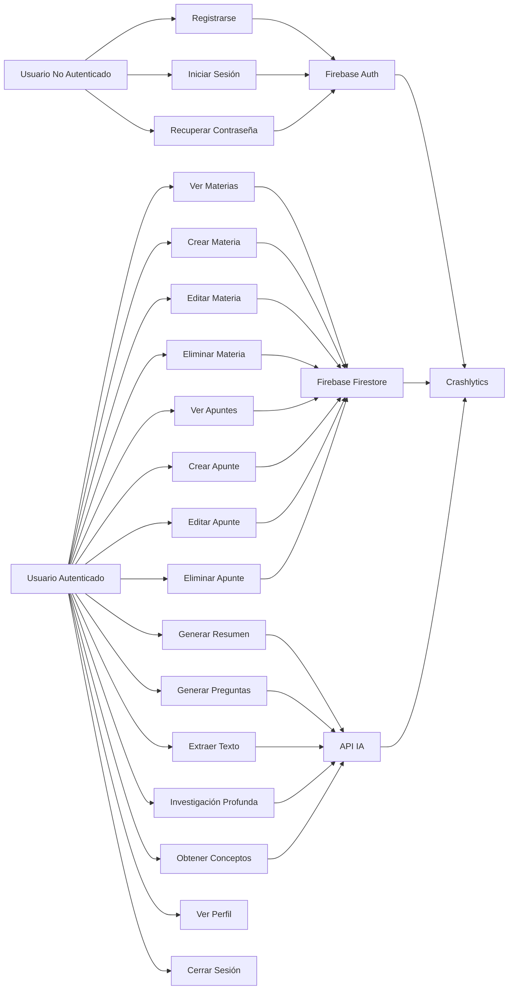
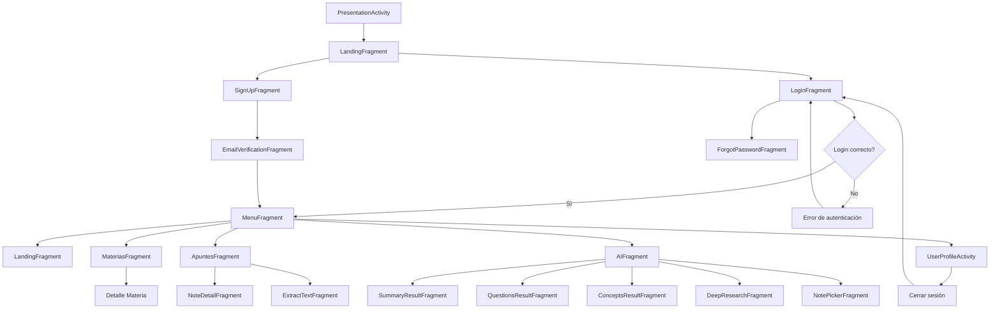
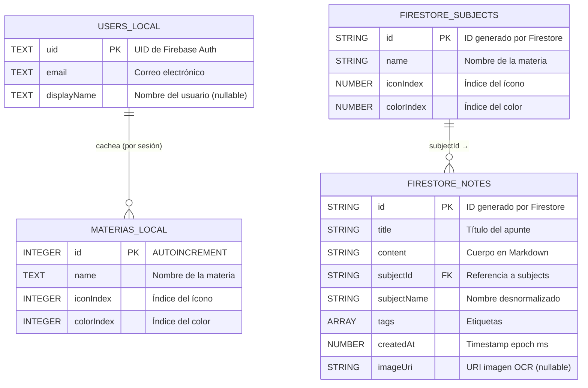
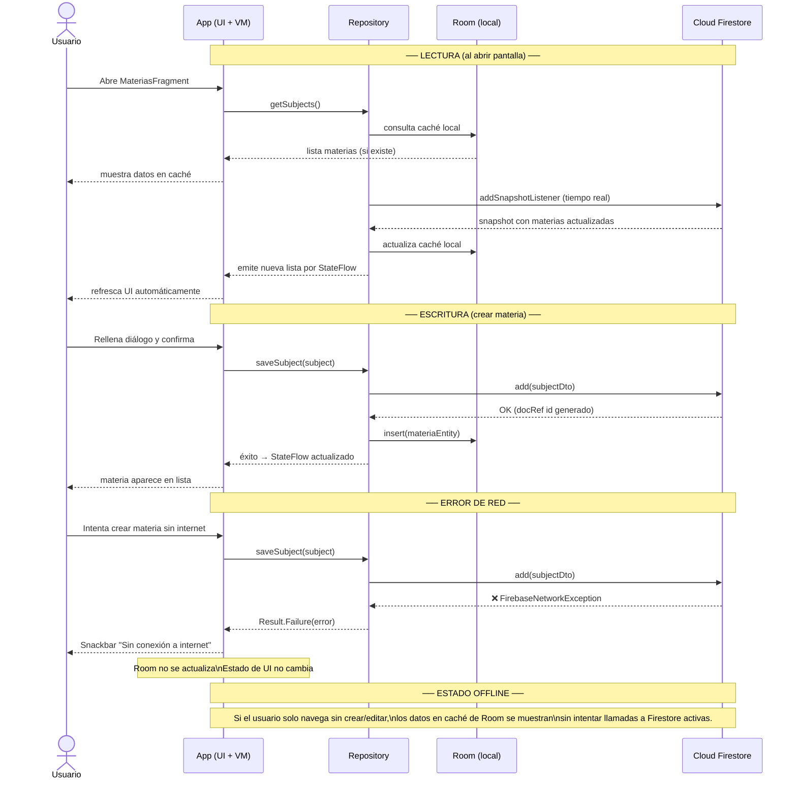
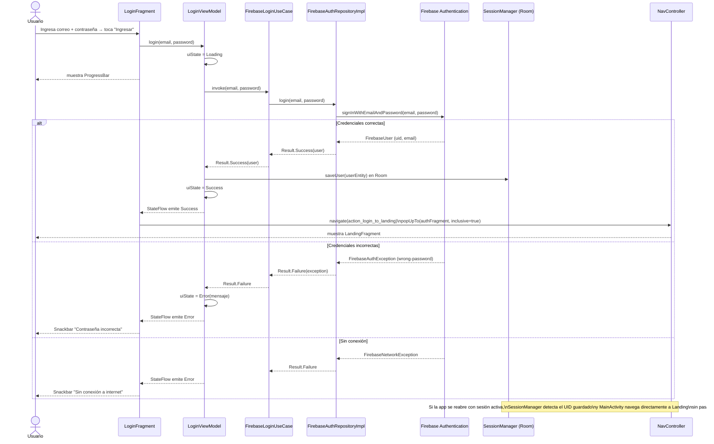
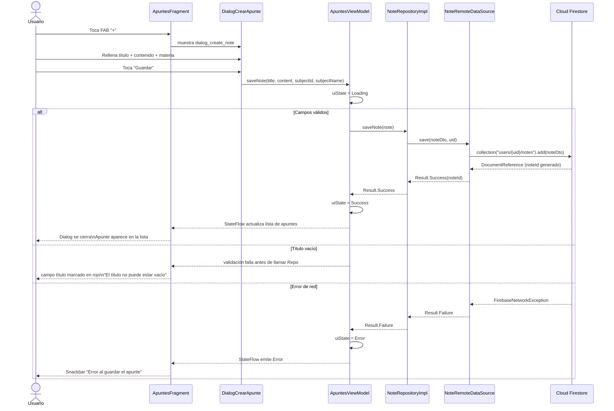
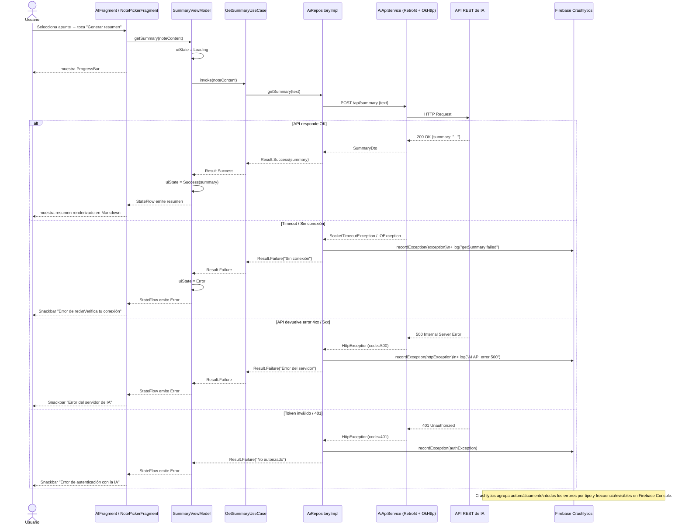

# D01 - Diagrama de Casos de Uso



# D02 - Flujo de Navegación



# D03 - Arquitectura Móvil (MVVM)

```mermaid
flowchart TD

subgraph UI
A[Fragments / Activities]
A1[LoginFragment]
A2[MateriasFragment]
A3[ApuntesFragment]
A4[AIFragment]
A5[Profile]
end

subgraph ViewModel
B1[LoginViewModel]
B2[MateriasViewModel]
B3[ApuntesViewModel]
B4[DeepResearchViewModel]
B5[UserProfileViewModel]
end

subgraph Repository
C1[AuthRepository]
C2[SubjectRepository]
C3[NoteRepository]
C4[AiRepository]
end

subgraph Local
D1[Room Database]
D2[UserDao]
D3[MateriaDao]
D4[UserEntity]
D5[MateriaEntity]
end

subgraph Remote
E1[Firebase Auth]
E2[Firestore]
E3[AI API]
end

subgraph Monitoring
F1[Crashlytics]
end

A --> B1
A --> B2
A --> B3
A --> B4
A --> B5

B1 --> C1
B2 --> C2
B3 --> C3
B4 --> C4

C2 --> D1
C3 --> D1

C1 --> E1
C2 --> E2
C3 --> E2
C4 --> E3

E1 --> F1
E2 --> F1
E3 --> F1
```


## D04 — Diagrama de Modelo de Datos Local y Remoto



> **Nota de ubicación:**
> - `USERS_LOCAL` y `MATERIAS_LOCAL` → Room (SQLite en el dispositivo)
> - `FIRESTORE_SUBJECTS` → `Firestore: users/{uid}/subjects/{subjectId}`
> - `FIRESTORE_NOTES` → `Firestore: users/{uid}/notes/{noteId}`
> - Los apuntes **no** se cachean en Room; siempre se leen desde Firestore.

---

## D05 — Diagrama de Sincronización Local-Remoto



---

## D06 — Diagramas de Secuencia

### D06.1 — Login / Recuperación de sesión



---

### D06.2 — Crear apunte con persistencia en Firestore



---

### D06.3 — Error de red y reporte a Crashlytics



---

## D07 — Diagrama de Estructura de Carpetas

```
maestrIA/
│
├── app/                                ← Módulo principal de la aplicación Android
│   └── src/main/
│       ├── AndroidManifest.xml         ← Permisos, activities, FileProvider
│       └── java/.../proy_prog_mobile/
│           └── app/
│               │
│               ├── MaestrIAApplication.kt   ← Punto de entrada de Hilt (@HiltAndroidApp)
│               ├── MainActivity.kt          ← Activity principal, aloja NavHostFragment
│               ├── PresentationActivity.kt  ← Splash / pantalla de presentación
│               │
│               ├── ui/                      ← Capa de presentación (Fragments + ViewModels)
│               │   ├── auth/                ← AuthFragment (contenedor Login/SignUp)
│               │   ├── login/               ← LoginFragment, ForgotPasswordFragment, LoginViewModel
│               │   ├── signup/              ← SignUpFragment, EmailVerificationFragment, SignUpViewModel
│               │   ├── landing/             ← LandingFragment, LandingViewModel (apuntes recientes)
│               │   ├── materias/            ← MateriasFragment, MateriasViewModel
│               │   ├── apuntes/             ← ApuntesFragment, NoteDetailFragment,
│               │   │                           ExtractTextFragment + sus ViewModels
│               │   └── AI/                  ← AIFragment, NotePickerFragment, DeepResearchFragment
│               │       └── result/          ← SummaryResultFragment, ConceptsResultFragment,
│               │                               QuestionsResultFragment + sus ViewModels
│               │
│               ├── domain/                  ← Capa de dominio (independiente de Android)
│               │   ├── model/               ← Clases de dominio: Note, Subject, User,
│               │   │                           ConceptItem, QAItem, DeepResearchResult
│               │   ├── repository/          ← Interfaces: AuthRepository, NoteRepository,
│               │   │                           SubjectRepository, AiRepository
│               │   └── usecase/             ← Casos de uso: FirebaseLoginUseCase,
│               │                               FirebaseSignUpUseCase, ForgotPasswordUseCase,
│               │                               GetSummaryUseCase, GetConceptsUseCase,
│               │                               GetQuestionsUseCase, DeepResearchUseCase,
│               │                               ExtractTextUseCase
│               │
│               ├── data/                    ← Capa de datos (implementaciones concretas)
│               │   ├── local/               ← Room: AppDatabase, DAOs, Entities, Prefs
│               │   │   ├── AppDatabase.kt
│               │   │   ├── AIModelPrefs.kt
│               │   │   ├── dao/             ← UserDao, MateriaDao
│               │   │   └── entity/          ← UserEntity, MateriaEntity
│               │   └── remote/
│               │       ├── FirebaseAuthRepositoryImpl.kt   ← Auth con Firebase
│               │       ├── firebase/        ← NoteRemoteDataSource, SubjectRemoteDataSource,
│               │       │                       NoteRepositoryImpl, SubjectRepositoryImpl,
│               │       │                       NoteDto, SubjectDto
│               │       └── ai/              ← AiApiService (Retrofit), AiRepositoryImpl,
│               │                               AuthInterceptor, DTOs (SummaryDto, ConceptsDto,
│               │                               QuestionsDto, DeepResearchDto, ExtractTextDto)
│               │
│               └── di/                      ← Módulos Hilt (inyección de dependencias)
│                   ├── AiModule.kt          ← provee Retrofit, OkHttp, AiApiService
│                   ├── DatabaseModule.kt    ← provee AppDatabase, DAOs
│                   ├── FirebaseModule.kt    ← provee FirebaseAuth, Firestore
│                   ├── RepositoryModule.kt  ← bindea interfaces con implementaciones
│                   └── SubjectNoteModule.kt ← provee SubjectRemoteDataSource, NoteRemoteDataSource
│
├── docs/                               ← Documentación del proyecto
│   ├── SRS.md                          ← Especificación de requisitos (IEEE 830)
│   ├── arquitectura.md                 ← Decisiones de arquitectura
│   └── diagramas/
│       └── diagramas.md                ← Este archivo (D01–D08)
│
├── Entregable-MVVM/                    ← Documentos de entrega académica
│   ├── PROMPT.md
│   └── DECISIONES.md
│
├── gradle/
│   └── libs.versions.toml              ← Catálogo de versiones de dependencias
├── build.gradle.kts                    ← Configuración global del proyecto
├── settings.gradle.kts                 ← Nombre del proyecto y módulos
└── .gitignore
```

> **Responsabilidad de cada capa:**
> - `ui/` — solo renderiza estado y delega acciones al ViewModel. No tiene lógica de negocio.
> - `domain/` — núcleo de la app. No depende de Android ni de Firebase. Es testeable de forma aislada.
> - `data/` — implementa las interfaces del dominio. Conoce Firebase, Room y Retrofit.
> - `di/` — conecta todo mediante Hilt. Define el ciclo de vida de cada dependencia.

---

## D08 — Diagrama de Despliegue / Servicios

```mermaid
graph TB
    subgraph DEVICE["📱 Dispositivo Android (API 24+)"]
        subgraph APP["App MaestrIA"]
            UI_LAYER["UI — Fragments / Activities"]
            VM_LAYER["ViewModels + Use Cases"]
            ROOM_DB["Room Database\n(SQLite local)\nusers · materias"]
            PREFS["SharedPreferences\nAIModelPrefs · SessionManager"]
            FILE_PROV["FileProvider\narchivos temporales cámara"]
        end
        CAM["📷 Cámara del dispositivo"]
    end

    subgraph GOOGLE_SERVICES["☁️ Google / Firebase Cloud"]
        FB_AUTH["🔥 Firebase Authentication\nRegistro · Login · Verificación\ncorreo · Reset password"]
        FS_DB["☁️ Cloud Firestore\nusers/{uid}/subjects\nusers/{uid}/notes"]
        CRASHLYTICS["📊 Firebase Crashlytics\nReporte automático de crashes\ny errores no fatales"]
    end

    subgraph AI_BACKEND["🤖 Backend de IA (servicio propio)"]
        AI_API["API REST\nGemini backend\nPOST /api/summary\nPOST /api/concepts\nPOST /api/questions\nPOST /api/deep-research\nPOST /api/extract-text"]
    end

    subgraph PERMISOS["🔐 Permisos del sistema"]
        PERM_NET["INTERNET (normal)"]
        PERM_CAM["android.hardware.camera\n(required=false)"]
        PERM_FILE["FileProvider\n(contenido seguro entre apps)"]
    end

    UI_LAYER <-->|StateFlow / eventos| VM_LAYER
    VM_LAYER <-->|CRUD local| ROOM_DB
    VM_LAYER <-->|preferencias| PREFS
    CAM <-->|Uri de imagen| FILE_PROV
    FILE_PROV <-->|multipart upload| AI_API

    VM_LAYER <-->|Auth calls| FB_AUTH
    VM_LAYER <-->|snapshot / write / delete| FS_DB
    VM_LAYER <-->|HTTP Bearer token| AI_API
    VM_LAYER -.->|auto-reporte errores| CRASHLYTICS

    APP -.->|requiere| PERM_NET
    APP -.->|requiere| PERM_CAM
    APP -.->|requiere| PERM_FILE

    style DEVICE fill:#1a1a2e,stroke:#2E86C1,color:#fff
    style GOOGLE_SERVICES fill:#1B3A4B,stroke:#f57c00,color:#fff
    style AI_BACKEND fill:#1B4F2A,stroke:#2E7D32,color:#fff
    style PERMISOS fill:#3B1B4F,stroke:#7B1FA2,color:#fff